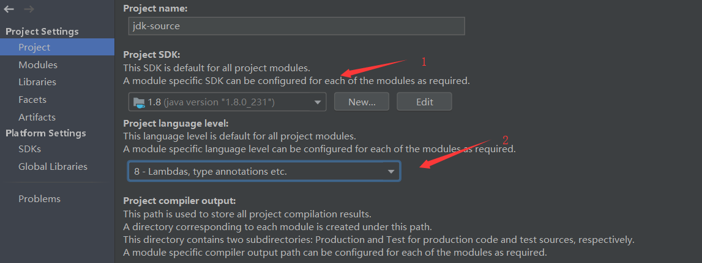

# JDK源码

## 说明

项目记录JDK源码分析的源码注释，基于JDK版本不同而使用不同的分支：

- jdk-7：基于JDK 1.7
- jdk-8：基于JDK 1.8

源码分析以`JDK7`为主，其他分支只分析该版本的重点修改处。

## 环境

项目只会分析部分类，所以环境需要基于对应版本的JDK，IDEA中切换版本方式：

进入`File->Project Structure`

